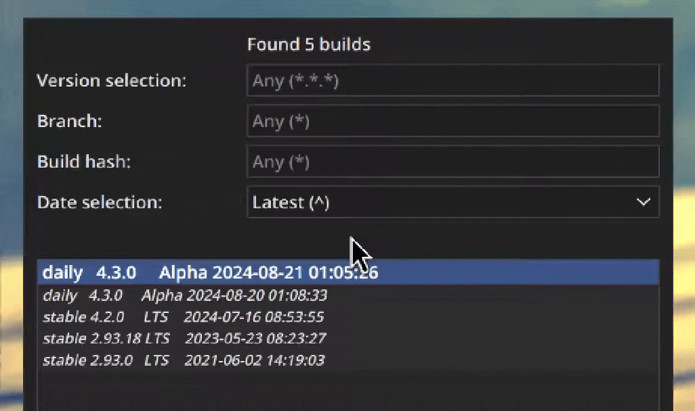

<style>body {text-align: justify}</style>

# File Association

??? image "Screenshot"
    <figure>
      
      <figcaption>The launching window</figcaption>
    </figure>

File associations allow you to open .blend files with BLV2, and quickly launch whichever build you want.


## Version Searching

### Ordering by Age / Value

[Versions](file_association.md#version-selection) and [Dates](file_association.md#date-selection) can be ordered by using these symbols:

- `^`: Compares the newest/largest version.
- `*`: Lets anything pass. It is a placeholder and does nothing.
- `-`: Compares the oldest/smallest version.

### Version Selection

This restricts what major, minor, and patch versions can be considered. Valid examples of version selections are:

- `*.*.*`: Match any version
- `4.3.^`: Match the latest version of 4.3
- `4.-.-`: Match the oldest version of the major version 4.*
- `^.^.^`: Match the latest version

### Branch

If you want only daily builds, you would specify `daily` in this box. If you want all branches,
leave this box empty and it will default to `*`.

### Build Hash

This is a very useful way to narrow down to one build quickly, as most of the time build hashes are unique.

### Date Selection

As mentioned above, the date selection can be used to narrow down the search based on date. As our system isn't
very resilient with matching dates, We only expose the ordering options to users.

## Build List

{align=right width=350 loading=lazy }

This contains all the builds you have downloaded in your system with all relevant information,
which includes the version, branch name, label, and the commit time. Builds in bold are matched
from the current search, and the smaller/lighter builds are filtered out by the search query and are not selected.

You can launch a specific build by double-clicking it,
and the relevant data will be pushed to the search options.

## Launch timer

!!! info "Conditions"
    **This timer appears when a build is specified,**
    **or the version search matches only one build.**

When the launching window dialogue appears, there is a chance a timer is placed at the bottom of the window.
The timer can be cancelled by editing any of the text boxes or cancelling the launch by pressing ESC or the "Cancel" button.

The duration of the timer can be edited in the settings.

Special values:

- `-1` Disables the timer
- `0` Skips the launcher dialogue if a build was found

## Save Current Search

!!! info "Conditions"
    **This button only appears when a build is specified, and the version stored in the header was sucessfully parsed.**

Saving the current search will save the created query to your settings, whenever a build with the parsed version is found, this search query will automatically fill the search options.

## Launching via the Commandline

    usage: main.py launch [-h] [-f FILE | -ol] [-v VERSION] [-c]

    options:
    -h, --help            show this help message and exit
    -f FILE, --file FILE  Path to a specific Blender file to launch.
    -ol, --open-last      Open the last file in the specified blender build
    -v VERSION, --version VERSION
                            Version to launch.
    -c, --cli             Launch Blender from CLI. does not open any QT frontend. WARNING: LIKELY
                            DOES NOT WORK IN WINDOWS BUNDLED EXECUTABLE

The version queries in the commandline are parsed a little differently than in the launching window, using this syntax:

    <major_num>.<minor>.<patch>[-<branch>][+<build_hash>][@<commit time>]

All the parts of the version are optional, except for the initial three digits/wildcards.
The branch is specified with a `-` symbol, the build_hash is specified with a `+` handle, and the commit_time is specified with an `@` symbol.

Running it in cli mode is not recommended in Windows as logging is a little messy, but on Linux it should work fine.
It avoids creating a QT frontend whenever possible, and should take as little effort to launch.

### Examples

=== "Quick launch build"

    ```bash
    path/to/BLV2 launch
    ```

=== "latest daily 4.3 build"

    ```bash
    path/to/BLV2 launch -v "4.3.^-daily@^"
    ```

=== "Oldest build downloaded"

    ```bash
    path/to/BLV2 launch -v "*.*.*@-"
    ```

=== "specific build & specific file"

    ```bash
    path/to/BLV2 launch -v "4.2.0+a51f293548ad" -f "~/Blender/file.blend"
    ```

All these examples can be given a `-c` flag to not open the QT frontend.
