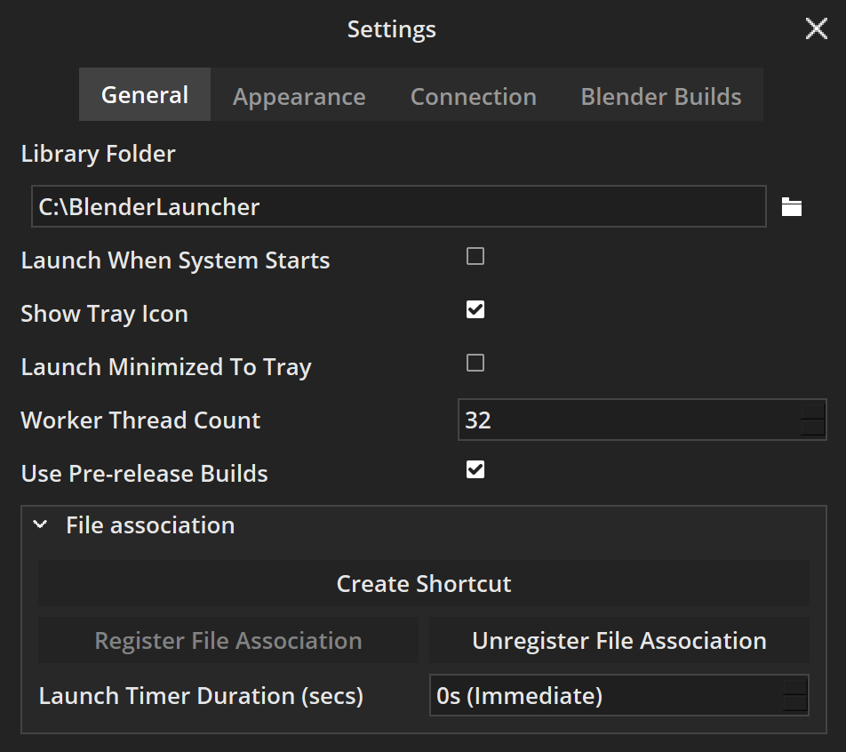
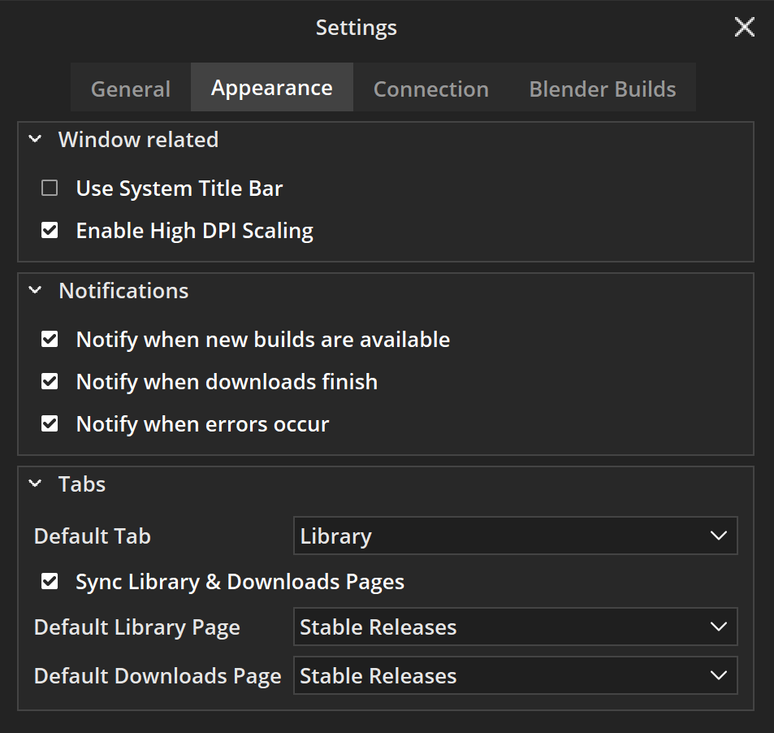
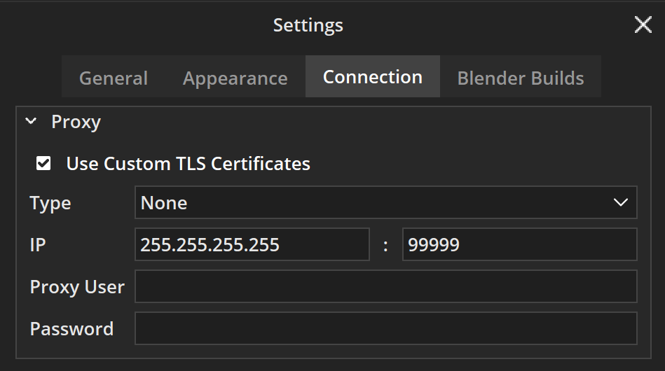
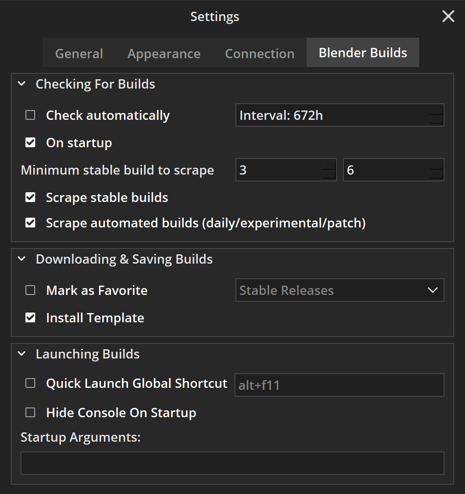

<style>body {text-align: justify}</style>

# Settings

## Settings Window

To open the **Settings Window**, use the button with a gear icon on the top left of the **Main Window**. All changes are saved automatically.

## General



### Library Folder

**Library Folder** - a directory on the hard drive where all downloaded builds are stored. For detailed information, check the [Library Folder](library_folder.md) page.

### Launch When System Starts

!!! info
    This only works on Windows.

:   Determines if **Blender Launcher** will run when the system starts.

### Show Tray Icon

:   Toggles the visibility of the tray icon. If the option is disabled, **Blender Launcher** will shut down after closing its **Main Window**.

### Launch Minimized To Tray

:   Determines if the **Main Window** will pop up when the user executes **Blender Launcher**, or only the tray icon will be shown.

### Worker Thread Count

:   Sets the maximal number of **CPU Thread Blender** Launcher can use.

## Appearance



### Window

#### Use System Title Bar

#### Enable High DPI Scaling

:   Determines if the **Blender Launcher** user interface will automatically scale based on the monitor's pixel density. To apply changes, the application should be restarted.

### Notifications

#### New Available Build

:   Show OS notifications when new builds of Blender are available in the Downloads tab.

#### Finished Downloading

:   Show OS notifications when a build finished downloading and is added to the Library tab.

#### Errors

:   Show OS notification when an error occurs on the Blender Launcher.

### Tabs

#### Default Tab

:   Set which tab will be opened when **Blender Launcher** starts.

#### Sync Library & Downloads

:   Determines if the pages of Library and Downloads tabs will be automatically matched with each other.

#### Default Library Page

:   Sets which page of the Library tab will be opened when **Blender Launcher** starts.

#### Default Downloads Page

:   Sets which page of the Downloads tab will be opened when **Blender Launcher** starts.

## Connection



### Proxy

#### Use Custom TLS Certificates

:   Enables the use of custom TLS certificates for secure communication with the proxy server.

#### Type

:   Specifies the type of proxy server to connect to (e.g., HTTP, SOCKS).

#### IP

:   Specifies the IP address of the proxy server and port number through which Blender Launcher will connect to the proxy server.

#### Proxy User

:   Specifies the username required to authenticate with the proxy server, if applicable.

#### Password

:   Specifies the password required to authenticate with the proxy server, if applicable.

## Blender Builds



### Checking For Builds

#### Check Automatically

:   Automatically check if a new build has been released and send a notification if there is a new one available.

#### On Startup

:   If Blender launcher will check for a new build when launched.

#### Min Stable Build to Scrape

:   Set the minimum Blender version to scrape; this reduces the request amount and speeds up the build gathering time.

#### Scrape Stable Builds

:   If the Blender Launcher will gather the Stable build, disabling this will speed up the gathering of the daily build.

#### Scrape Automated Builds

:   If the Blender Launcher will gather the automated daily build (daily, experimental, patch).

### Downloading & Saving build

Actions that will be performed on newly added builds to Library tab right after downloading is finished.

#### Mark As Favorite

:   Mark every newly added build to the Library tab as favorite depending on the branch type.

#### Install Template

:   Installs a template on newly added builds to the Library tab.

### Launching Builds

#### Quick Launch Global SHC

:   Launches builds added to quick launch via a user-defined key sequence.

#### Hide Console On Startup

!!! info
    This only works on Windows.

:   Launch Blender via `blender-launcher.exe` to hide the console on startup. Works on Blender version 3.0 and higher.

    !!! warning "Known Issues"

        When using this feature, the number of running instances will not be shown.

#### Startup Arguments

:   Adds specific instructions as if Blender were launching from the command line (after the blender executable i.e. `blender [args …]`).

:   For example, the `-W` (force opening Blender in fullscreen mode) argument internally will produce the following command:

    ```
    %path to blender executable% -W
    ```

:   List of commands can be found on Blender manual [Command Line Arguments](https://docs.blender.org/manual/en/latest/advanced/command_line/arguments.html) page.

#### Bash Arguments

!!! info
    This only works on Windows.

:   Adds specific instructions as if Blender were launching from the command line (before the blender executable i.e. `[args …] blender`).

:   For example, `env __NV_PRIME_RENDER_OFFLOAD=1 __GLX_VENDOR_LIBRARY_NAME=nvidia` (force Blender to use a dedicated graphics card) arguments internally will produce the following command:

    ```
    env __NV_PRIME_RENDER_OFFLOAD=1 __GLX_VENDOR_LIBRARY_NAME=nvidia nohup %path to blender executable% %startup arguments%
    ```
```